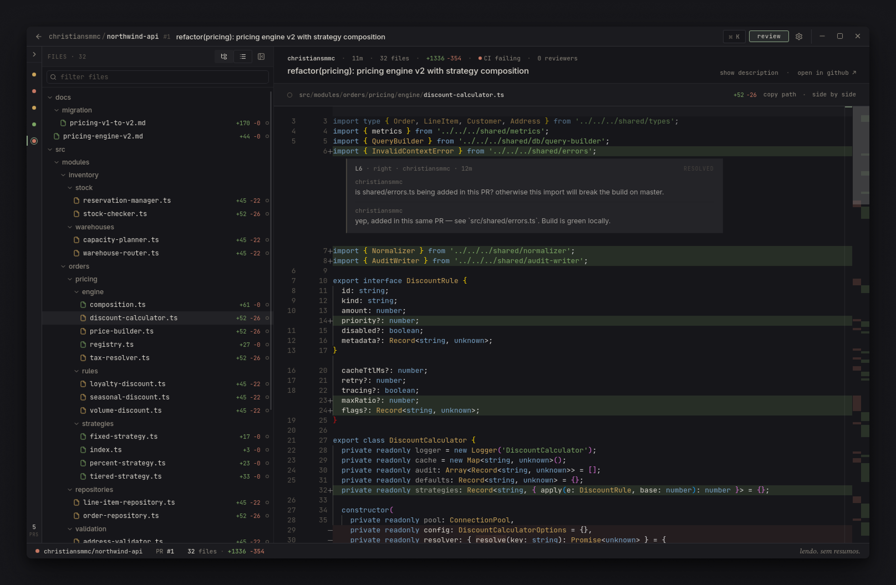
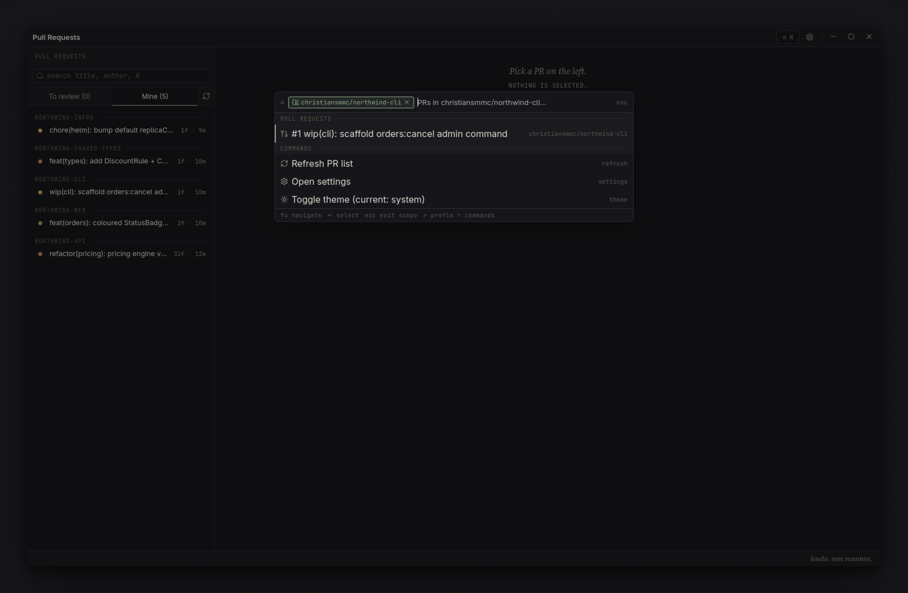
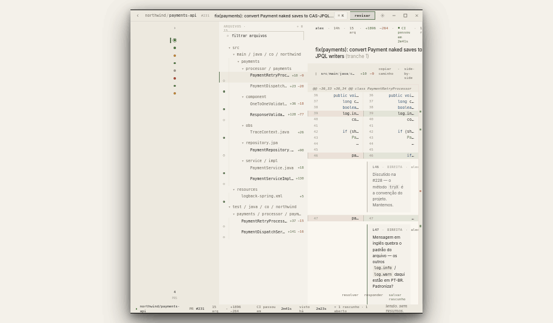
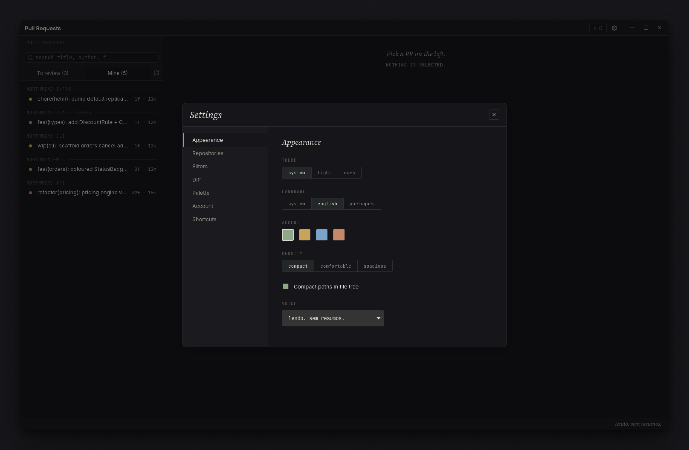
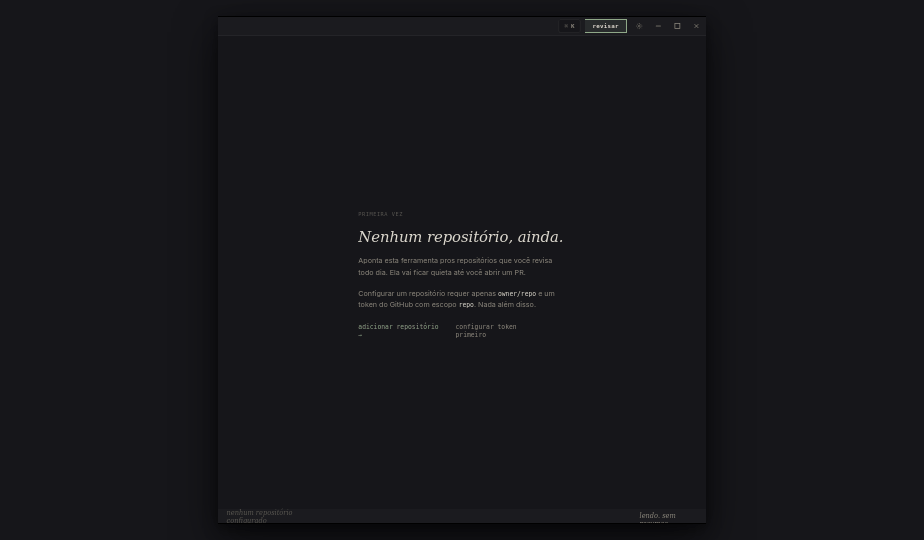

<p align="center">
  
</p>

<h1 align="center">Galley</h1>

<p align="center">
  A Linux desktop GitHub PR reviewer.
</p>

---

You read code. You write comments. You ship because you understand what changed — not because something else told you what it meant.

Galley does not summarize pull requests. It does not suggest fixes. It does not autocomplete comments. It shows you the diff, opens a workshop around it, and stays out of your way.

> *"Reading. No summaries."*

Tauri 2 + React/TypeScript. Linen (dark) / Paper (light). Sage accent. Keyboard-first. Local-first.



## Status

Personal project, used daily on Fedora. Builds known to work on:

- **Fedora 41–43 / Nobara** — `.rpm` bundle
- **Ubuntu 22.04+** — `.deb` bundle (needs `libwebkit2gtk-4.1`)

macOS / Windows are not tested. Tauri can target them; PRs welcome.

## What's inside

**Multi-repo PR list.** Grouped by repo, fuzzy-searchable. **Author names hidden by default** — you already know who you are.

**Side-by-side or inline diff** (Monaco-based). Per-file viewed state via a single dot — click to toggle. **No AI-suggested fixes in the margin.**

**Inline comments on the modified side.** Three thread states — *open*, *draft*, *resolved* — communicated entirely by the left-edge rule. No chips, no badges, no colored fills. Range comments via line selection.

**Local-first drafts.** Persisted in SQLite. Never round-trip to a server until you submit the whole review.

**Command palette** (`Ctrl+K`). Fuzzy across PRs, files, repos, commands. The footer reads *"no suggestions. only what you search for."* — visible until you type.



**Linen (dark) + Paper (light) themes.** Sage / ochre / ink / rust accents. Compact / comfortable / spacious density.

<table>
  <tr>
    <td></td>
    <td></td>
  </tr>
  <tr>
    <td align="center"><em>Linen — the default</em></td>
    <td align="center"><em>Paper — warm light, the same restraint</em></td>
  </tr>
</table>

**English + Portuguese (BR).** Toggle in Settings → Appearance. The status line carries an italic-serif voice line in your locale; pick from a small set, or set your own.

**Settings is a single modal.** Seven sections, italic-serif titles, hairline-bordered segmented controls. Nothing that looks like a SaaS dashboard.



## Install

Grab the matching artefact from the [latest release](https://github.com/christiansmmc/galley/releases/latest).

### Fedora / RHEL / Nobara

```bash
sudo dnf install ./Galley-<version>-1.x86_64.rpm
```

### Ubuntu / Debian

```bash
sudo apt install ./Galley_<version>_amd64.deb
```

After install, launch from your desktop menu (the app appears as **Galley**). The binary is at `/usr/bin/pr-reviewer` — the internal crate name was kept on rename to preserve `dnf` upgrade paths.

## First run



Galley needs a GitHub personal access token with the `repo` scope.

1. Create one at [github.com/settings/tokens?type=beta](https://github.com/settings/tokens?type=beta) (fine-grained) or [github.com/settings/tokens](https://github.com/settings/tokens) (classic).
2. Paste it on the first-run screen.
3. Add one or more repositories under **Settings → Repositories**.

The token is stored in your OS keyring (libsecret / secret-service on Linux). It is **never written to a file inside the project tree or to disk in plaintext** — keyring is the only persistence path.

## Building from source

Requires Rust (latest stable), Node ≥ 20, pnpm, and the Tauri 2 system deps.

### Fedora

```bash
sudo dnf install dbus-devel webkit2gtk4.1-devel libsoup3-devel \
  librsvg2-devel libayatana-appindicator-gtk3-devel openssl-devel gtk3-devel
```

### Ubuntu

```bash
sudo apt install libwebkit2gtk-4.1-dev libssl-dev \
  libayatana-appindicator3-dev librsvg2-dev libsoup-3.0-dev libdbus-1-dev
```

### Build

```bash
pnpm install
pnpm tauri dev                                   # dev mode with hot reload
pnpm exec vite build                             # frontend production build
NO_STRIP=true pnpm tauri build --bundles rpm     # Fedora rpm
NO_STRIP=true pnpm tauri build --bundles deb     # Ubuntu deb
```

`NO_STRIP=true` is required on Fedora — `linuxdeploy`'s bundled `strip` cannot read `SHT_RELR` in modern host libs.

Webkit + Wayland on Fedora needs `WEBKIT_DISABLE_DMABUF_RENDERER=1`; `main.rs` already sets this before webkit init.

## Tests

```bash
pnpm tsc --noEmit             # type check
pnpm test                     # vitest component tests
cd src-tauri && cargo test    # Rust unit + integration tests
```

## Config locations

Galley uses the standard XDG dirs (paths follow the internal crate name):

- `~/.config/pr-reviewer/config.toml` — repos, path filters, UI prefs.
- `~/.local/share/pr-reviewer/cache.db` — SQLite cache + drafts.
- `~/.local/state/pr-reviewer/log.txt` — tracing logs.
- OS keyring — PAT (service = `pr-reviewer`, account = `github`).

## Project layout

```
src/                React frontend
  components/         UI (diff, files, prs, layout, settings, ui primitives)
  state/              Zustand stores (prsStore, settingsStore, draftsStore, uiStore)
  ipc/                Tauri command bindings (TS) + shared types
  styles/             tokens.css + globals.css

src-tauri/          Rust backend (Tauri 2)
  src/commands/       Tauri commands wired into invoke_handler
  src/secrets.rs      OS keyring access for the GitHub PAT
  capabilities/       Window/event permissions

design/etapa3-workshop/   Reference mock (HTML) + design spec
docs/superpowers/         Workshop progress notes, plans, specs
```

## Design

The visual language is documented in [`design/etapa3-workshop/README.md`](design/etapa3-workshop/README.md). Read it if you're contributing — Galley has opinions, and they're load-bearing.

**No AI features. No chips for state. No avatars. No spinners. No tours. No insights dashboards.** If you're about to open a PR that adds any of these, read the design memo first.

## License

[MIT](LICENSE).
